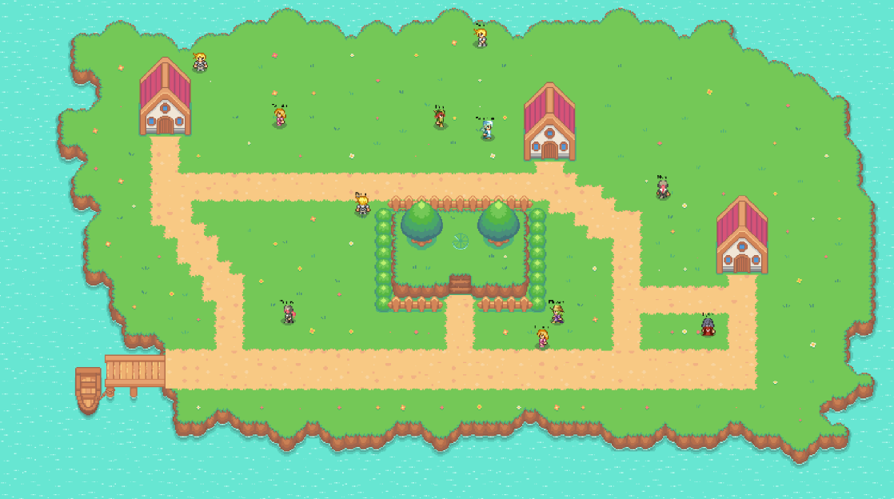

# Aumentando a interatividade e imersão de jogos eletrônicos do gênero RPG com modelos de linguagem de larga escala



Este repositório contém os arquivos do jogo RPG eletrônico desenvolvido para o artigo "[Aumentando a interatividade e imersão de jogos eletrônicos do gênero RPG com modelos de linguagem de larga escala](https://drive.google.com/file/d/132QPNaj88PNbER_lAMox8-WD4rPueuEo/view?usp=sharing)", que se trata de um Trabalho de Conclusão de Curso do curso de Ciência da Computação da Universidade Federal de Campina Grande. O jogo se trata de uma prova de conceito de um RPG eletrônico integrado com um modelo de linguagem visando aumentar a interatividade e imersão dos jogadores. Logo abaixo, é descrito o passo a passo para configurar e rodar o jogo na sua máquina local.

## Requisitos

- Node v20.12.1 (Apenas testado com essa versão)
- npm 10.8.2
- Docker (opcional)
- Banco de dados Redis (opcional se possuir o Docker)

## Instalação

```bash
# Clone o repositório
$ git clone https://github.com/marcossilvaxx/dinamic-rpg.git

# Acesse o diretório do projeto
$ cd ./dinamic-rpg

# Acesse o diretório do frontend
$ cd frontend/

# Instale as dependências
$ npm install

# Acesse o diretório do backend
$ cd ../backend/

# Instale as dependências
$ npm install
```

## Dica: Rodando o banco de dados Redis utilizando o Docker

```bash
# Crie o container do banco de dados Redis utilizando a imagem oficial do Redis

$ docker run --name redis-game -p 6379:6379 -d redis
```

## Configuração

Renomeie o arquivo `env.example.json` localizado no diretório `backend/` para `env.json` e preencha os valores para `OPENAI_API_KEY` e `OPENAI_PROJECT_ID` com sua chave de API da OpenAI e o id do seu Projeto da OpenAI (que pode ser encontrado acessando o link: https://platform.openai.com/organization/projects). Em seguida, altere o valor de `REDIS_HOST` e `REDIS_PORT` para o host e porta do seu banco de dados Redis.

```javascript
{
  "OPENAI_API_KEY": "",
  "OPENAI_PROJECT_ID": "",
  "REDIS_HOST": "localhost",
  "REDIS_PORT": 6379
}
```

Além disso, também renomeie o arquivo `env.example.json` encontrado no diretório `frontend/src/config/` para `env.json` e preencha `WEBSOCKET_SERVER_URL` com a url do servidor backend, que, por padrão, já está definido como `ws://localhost:8080`.

```javascript
{
  "WEBSOCKET_SERVER_URL": "ws://localhost:8080"
}
```

No arquivo `constants.js` encontrado no mesmo diretório, é possível escolher a quantidade de NPCs a serem gerados alterando o valor da constante `NUMBER_OF_NPCS`. Obs: É importante lembrar que quanto maior a quantidade de NPCs, mais demorado é o carregamento inicial do jogo.

```javascript
export const NUMBER_OF_NPCS = 5;
```

## Rodando o jogo

Após realizar as etapas de instalação e configuração, execute o seguinte comando em ambos os diretórios `frontend/` e `backend/`:

```bash
$ npm run dev
```

Em seguida acesse http://localhost:5173/ para iniciar o jogo. Divirta-se!

#### IMPORTANTE: Ao reiniciar o backend, os dados do banco de dados são apagados.

#### IMPORTANTE²: Se o backend for reiniciado, a página http://localhost:5173/ do frontend também precisa ser recarregada, para novos dados e NPCs serem gerados novamente.

## Créditos

- Tileset utilizado: https://cypor.itch.io/12x12-rpg-tileset by Cyporkador
- Sprites utilizados: https://opengameart.org/content/twelve-16x18-rpg-sprites-plus-base by Antifarea
- A engine criada para ser a base do jogo foi inspirada e baseada no código do tutorial do canal [Drew Conley](https://www.youtube.com/@DrewConley): https://www.youtube.com/watch?v=HmxNrlPx8iY
